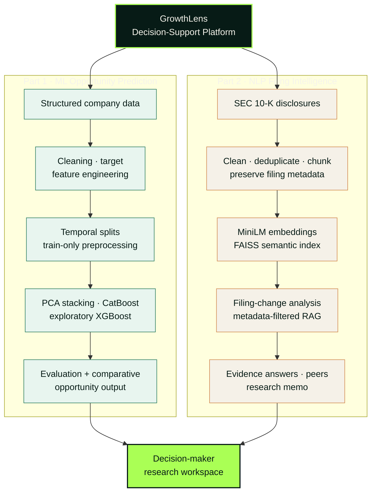
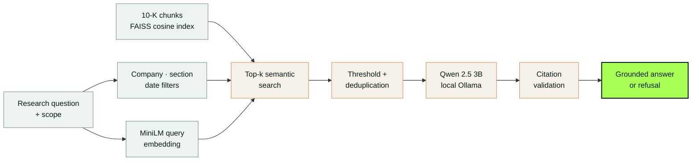

# GrowthLens Decision Support Platform

GrowthLens is an evidence-led equity-research platform that helps decision makers discover companies through ML opportunity scoring and investigate them through NLP analysis of annual filings.

The product has two distinct analytical parts. Its structured ML workflow creates a comparative opportunity score for company discovery. Its NLP workflow organizes material disclosure changes, shows the earlier and current evidence, explains why each change deserves attention, and keeps the original filing context visible.

[Open the public GrowthLens experience](https://altayariyasser.github.io/GrowthLens_Project/)

> GrowthLens supports research and review. It does not provide investment recommendations, return forecasts, live prices, or financial advice.

## Product walkthrough


The walkthrough follows the core research journey: open Filing Intelligence, choose a company, review its change portrait, scan ranked disclosures, expand source evidence, ask a filing-scoped question, and discover additional research candidates.

## What the project does

GrowthLens brings company discovery and annual-filing analysis into one research workflow:

- **Filing Intelligence** compares two annual filings and surfaces new, removed, modified, intensified, and softened disclosures.
- **Material Changes** groups changes into understandable business themes and assigns a transparent attention priority.
- **Evidence Review** connects every surfaced change to prior and current filing passages, dates, sections, accessions, and source links.
- **Peer Comparison** compares narrative themes across selected companies while preserving each company's filing date.
- **Ask GrowthLens** answers questions from the available filing evidence and produces an evidence-limited response when support is insufficient.
- **Research Memos** create a neutral, citation-oriented summary for further analyst review.
- **Discover Companies** filters research candidates by budget, sector, company size, financial characteristics, and a separate opportunity signal.

The opportunity signal is a discovery aid. It is not mathematically blended with filing-change attention and must not be interpreted as a probability, recommendation, or expected return.

## System architecture

GrowthLens combines the ML workflow in [`GrowthLens_Project.ipynb`](./GrowthLens_Project.ipynb) with an NLP filing-research workflow. The two outputs support one research workspace but remain independent.



The ML pipeline ends at the evaluated score and class. Budget, sector, company-size, and ranking controls belong to the interface, not model training.

### RAG flow



- **Search:** normalized MiniLM embeddings with FAISS exact cosine search; lexical matching is only a fallback.
- **Filtering:** company/CIK, accession, section, sector, and point-in-time filing date.
- **Guardrails:** evidence threshold, duplicate removal, source-ID validation, and refusal when support is weak.

**Decision flow:** Discover with ML → investigate with NLP → compare evidence → document the conclusion.

## Product workspaces

### Filing Intelligence

Select a company to review:

- filing-pair coverage;
- a visual change overview;
- material changes by topic and change type;
- attention-priority distribution;
- numerical changes found in disclosures;
- expandable prior/current evidence;
- peer context;
- evidence-based questions;
- memo export.

### Discover Companies

The discovery workspace lets a user explore companies using:

- investment budget and whole-share affordability;
- sector;
- micro-, small-, or mid-cap company size;
- minimum opportunity score;
- revenue growth, profitability, and momentum filters;
- price, market-cap, growth, momentum, and score sorting;
- side-by-side company comparison.

Prices in the demonstration are dated reference values, not live quotes. The budget tool estimates whole shares and does not represent trade execution.

### Peers and Reports

The peer workspace compares filing themes across selected companies. The reports workspace produces a research memo with material changes, filing context, evidence, and explicit limitations.

## Repository structure

```text
GrowthLens_Project/
|-- .github/workflows/pages.yml      # GitHub Pages build and deployment
|-- GrowthLens_Project.ipynb         # Structured financial-ML research notebook
|-- GrowthLens_Report.pdf            # Project report
|-- NLP_GrowthLens/                   # Public React/Vite application
|   |-- public/                       # Static visual assets
|   |-- src/
|   |   |-- components/               # Shared interface components
|   |   |-- data/                     # Curated precomputed public examples
|   |   |-- features/
|   |   |   |-- explorer/             # Company discovery and comparison
|   |   |   |-- intelligence/         # Filing changes, peers, Q&A, and memos
|   |   |   `-- research/             # Evidence presentation components
|   |   `-- lib/                      # Browser-side data and formatting layer
|   |-- package.json
|   `-- vite.config.js
`-- README.md
```


All public-edition operations happen inside the visitor's browser. The interface does not call a hidden API or require a running computer elsewhere.

## Research methodology

The Filing Intelligence design follows these principles:

- use filing date as the disclosure-availability date;
- keep prior and current evidence separate;
- preserve company, CIK, accession, section, filing date, and source provenance;
- treat added and removed passages as one-sided evidence cases;
- prevent a single paragraph from being matched to multiple passages;
- validate quoted values against source text;
- distinguish evidence quality from business importance;
- label capped or missing filing sections as partial coverage;
- refuse unsupported certainty;
- keep narrative attention separate from the structured opportunity score.

Attention priority is an explainable review-ordering aid based on disclosure novelty, section importance, risk-language movement, numerical changes, and evidence quality. It is not a prediction of price movement or company performance.

## Data and privacy

The public repository contains only curated demonstration records. It does not include the complete SEC corpus, structured parquet datasets, private caches, embeddings, model weights, credentials, or user data.

The GitHub Pages application is static. Questions in the public demonstration are processed against precomputed evidence in the browser and are not sent to an AI provider.

## Limitations

- The public edition is a product demonstration, not the full research universe.
- Filing comparisons may cover only the available sections and should not be described as complete-document analysis.
- Demonstration prices and financial fields are snapshots rather than live market data.
- An attention score measures review priority, not investment attractiveness.
- The opportunity signal is comparative and is not a calibrated probability.
- Generated or summarized conclusions should always be checked against the linked filing evidence.
- The notebook is a research artifact and may require its original data, GPU-oriented dependencies, and environment-specific configuration; it is not required to run the public website.

## Technology

- React 19
- Vite
- GSAP
- GitHub Pages and GitHub Actions
- Python/Jupyter for the structured research notebook
- SEC annual-filing data and structured company fundamentals in the private research workflow

## Project report

The accompanying [GrowthLens project report](./GrowthLens_Report.pdf) provides additional project context.

## Responsible use

GrowthLens is designed as a decision-support and research-organization tool. Users remain responsible for reviewing source filings, checking data freshness and completeness, and making independent financial decisions.
